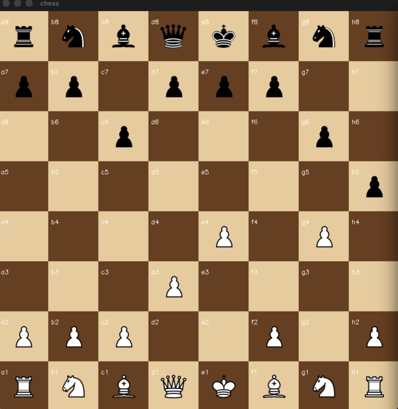

# ♟️ Ollama-Chess: OpenCV & LLM Entegrasyonu

Bu proje, satranç mekaniklerini modern yapay zeka ile birleştirir. **OpenCV** ile görsel arayüz sunar ve **Ollama (Llama 3)** ile hamle üretir.

## 🚀 Özellikler
- **Görüntü İşleme:** 800x800 OpenCV render tahta.
- **AI Rakibi:** Yerel çalışan Llama 3 modeli.
- **Kural Denetimi:** `python-chess` ile %100 yasal kontrol.

## 🛠️ Kurulum
1. `pip install numpy opencv-python chess requests`
2. `ollama pull llama3`
3. `python main.py`

---
**Geliştirici:** Şevval Aycan  
**Teknoloji:** Python, OpenCV, Ollama
